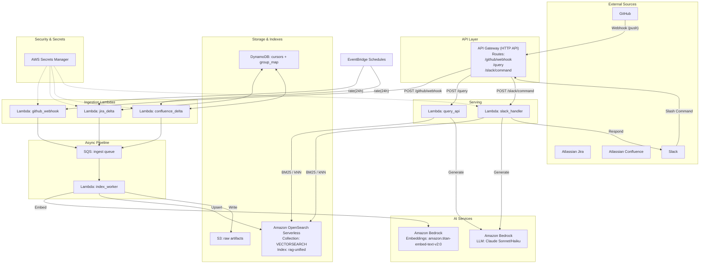

## Architecture and Design

This document describes the Terraform-based RAG system that ingests GitHub code, Jira issues, and Confluence pages, indexes them into Amazon OpenSearch Serverless, and serves answers via API and Slack.

### System Diagram

### Components
- **API Gateway (HTTP API)**: public endpoints for GitHub webhook, Query API, and Slack slash commands.
- **Ingestion Lambdas**:
  - `github_webhook`: validates signature, fetches changed files via GitHub API, enqueues for indexing.
  - `jira_delta`: scheduled delta by `updated`, emits issue + comment chunks.
  - `confluence_delta`: scheduled delta by `lastmodified`, emits page chunks.
- **SQS ingest queue**: buffers events for indexing.
- **index_worker**: embeds via Bedrock, upserts unified documents into OpenSearch, writes raw artifacts to S3.
- **query_api**: hybrid retrieval (BM25, kNN future) and returns citations; calls Bedrock LLM for generation (future).
- **slack_handler**: receives slash commands, retrieves, generates, and replies in-channel.
- **DynamoDB**: cursors for Jira/Confluence deltas; group map for ACLs (future).
- **Secrets Manager**: GitHub webhook secret, GitHub PAT, Jira/Confluence creds, Slack tokens.
- **OpenSearch Serverless**: `VECTORSEARCH` collection; index `rag-unified` for BM25 text + vector fields.

### Flow (concise)
- Ingest: GitHub webhooks and EventBridge schedules → Lambdas → SQS → index_worker → Bedrock embeddings → OpenSearch upserts.
- Query: API/Slack → OpenSearch retrieval → Bedrock LLM (optional) → Answer + citations.

### Reference
- Slack + Bedrock reference pattern adapted: [Create a generative AI assistant with Slack and Amazon Bedrock](https://aws.amazon.com/blogs/machine-learning/create-a-generative-ai-assistant-with-slack-and-amazon-bedrock/). 